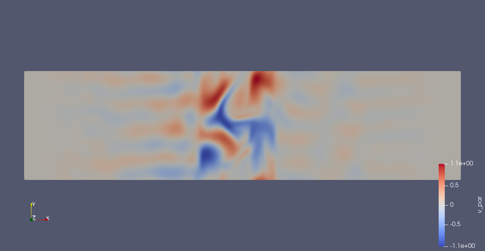
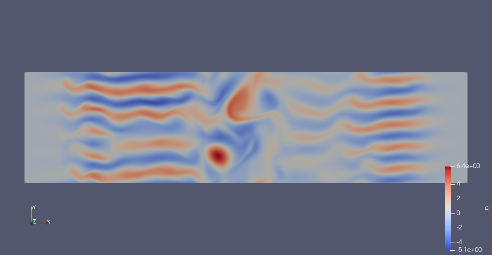
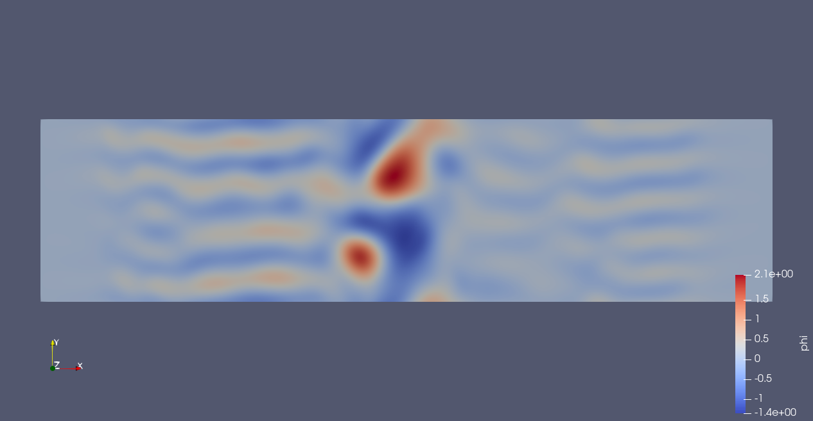
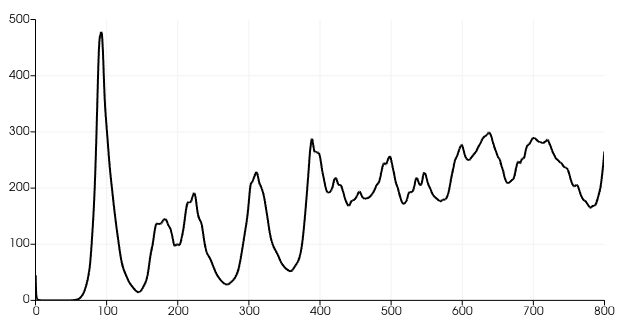

# DRIFT-port
FEM ports of Fortran DRIFT code (W. Arter, 1994)

The equations are (eqs. 2.2-2.8 in the paper) - note there is no toroidicity included (following advice from W. Arter)

$$
n = \phi - \alpha \frac{\partial \phi}{\partial x} - \beta\frac{\partial^3 \phi}{\partial x^3} - \nabla_{\perp}^2 \phi,
$$

$$
\left ( \frac{\partial}{\partial t} + v_E \cdot \nabla_{\perp} \right ) n = - \delta_n \frac{\partial \phi}{\partial x} + \delta_s (y-y_0) \frac{\partial v_{\parallel}}{\partial x} - \nu \nabla_{\perp}^4 \phi,
$$

$$
\left ( \frac{\partial}{\partial t} + v_E \cdot \nabla_{\perp} \right ) v_{\parallel} = + \delta_s (y-y_0) \frac{\partial \phi}{\partial x} + \left ( \mu_{\perp} \nabla_{\perp}^2 + \mu_{\parallel} \nabla_{\parallel}^2 \right ) v_{\parallel}.
$$

Here

$$
v_E = \left ( -\frac{\partial \phi}{\partial y}, \frac{\partial \phi}{\partial x}, 0 \right ).
$$

Now the game is to reproduce the contour plots in Fig.5.

Boundary conditions: $y$-direction homogeneous Dirichlet, $x$-direction periodic.

Initial data: see Eq.5.7 in the paper - random but energy spectrum and total energy are specified.

Parameter values:

$\nu = \mu_{\perp} = 0.01$

$\mu_{\parallel} \delta_s^2 = 0.03$

$\delta_n = -1$

$\delta_s = 0.2$

$\alpha = 0.744$

$\beta = 0.7$

The above choices give $\mu_{\parallel} = 0.75$.

Box size and centring $L_x =12.5$, $L_y = 50$ and $y_0 = 25$.

Other considerations:
**$\nu$ and $\mu_{\perp}$ are both set to $0.01$ unlike Arter who sets them to $0.1$ and then cranks them up to $0.3$ once the mode has started to appear.**  It looks like the $\mu_{\parallel}$ term suppresses edge modes because it is a viscosity, zero halfway up the domain and with a parabolic increase away from the halfway point.

Equations in weak form: TBC (or just read the UFL in the script :))

Sample outputs: these are the three fields halfway through the run of DRIFT-port_dev.py (i.e. at t=400).

)
)
)

# Behaviour of energy

I have defined the energy as $\int d^2 x \left ( n \phi + v_{\parallel}^2 \right )$ (should there be a factor of $\frac{1}{2}$ in the kinetic term?) - see below for a time-series energy trace.  Note how low the energy goes before the mode starts to develop.  Linear and log plots shown.

 energy for the script {\tt DRIFT-port_dev.py} used to generate the fields shown above")

