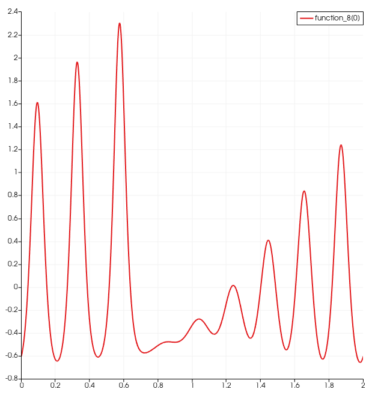

# DRIFT-port/tests

KdV_equation:  implementation of the KdV equation in FEM using auxilliary field to handle the higher derivative.  The test script produces a similar output to the numerical example animated at https://en.wikipedia.org/wiki/Korteweg%E2%80%93De_Vries_equation.

Linear_test: this is an attempt to reproduce linear outputs generated by Arter.  TBC!
