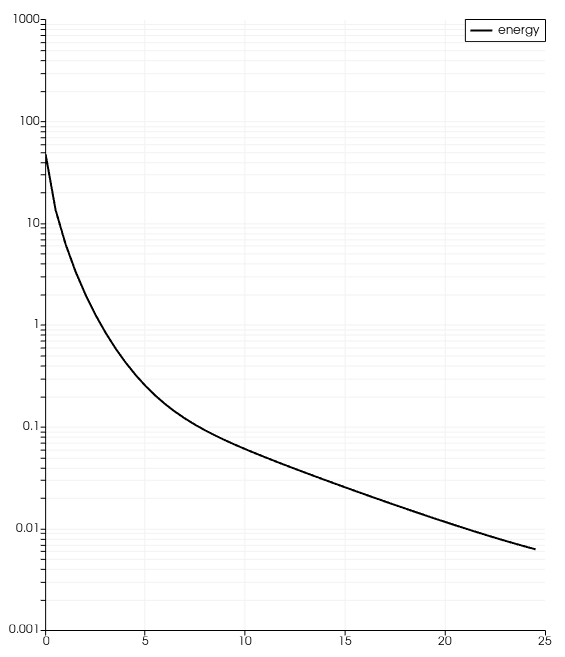
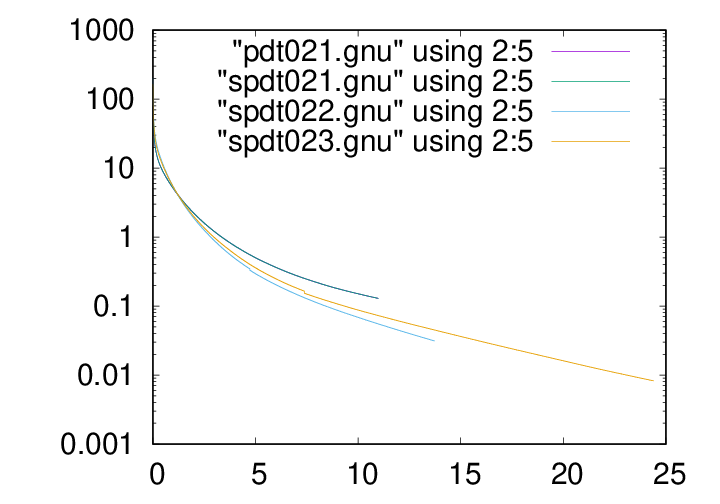

# DRIFT-port/tests

The most simple test is the decay rate of the energy in the initial data.  The code produces the output (vertical axis is log10 of energy, horizontal axis is time)

This can be compared to the decay of the energy in the original DRIFT code, using the same initial data (axes same):

# Other tests:

KdV_equation:  implementation of the KdV equation in FEM using auxilliary field to handle the higher derivative.  The test script produces a similar output to the numerical example animated at https://en.wikipedia.org/wiki/Korteweg%E2%80%93De_Vries_equation.

Linear_test: this is an attempt to reproduce linear outputs generated by Arter.  TBC!
